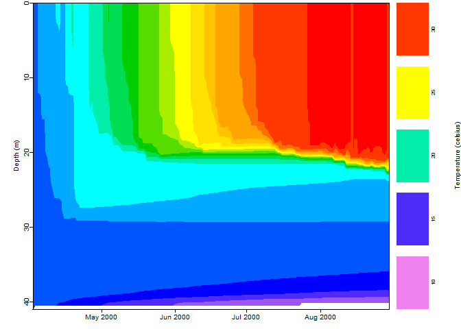

<!-- README.md is generated from README.Rmd. Please edit that file -->
GLMr
====

| Linux                                                                                                   | Mac                                                                                                     | Windows                                                                                                                                   |
|---------------------------------------------------------------------------------------------------------|---------------------------------------------------------------------------------------------------------|-------------------------------------------------------------------------------------------------------------------------------------------|
| [](https://travis-ci.org/GLEON/GLMr) | [](https://travis-ci.org/GLEON/GLMr) | [](https://ci.appveyor.com/project/jread-usgs/glmr) |

[](https://zenodo.org/badge/latestdoi/23404/GLEON/GLMr)

R package for basic [GLM](http://aed.see.uwa.edu.au/research/models/GLM/) model running. `GLMr` is designed to hold the most current version of the General Lake Model (GLM) for linux, mac, and windows platforms. This package does not contain the source code for the model, only the executable, and functions for handling the various platform requirements for running the model. Also, use `glm_version()` to figure out what version of GLM you are running.

Installation
------------

You can install GLMr from Github with:

``` r
# install.packages("devtools")
devtools::install_github("GLEON/GLMr")
```

Usage
-----

### Run

``` r
library(GLMr)

sim_folder <- system.file('extdata', package = 'GLMr')

run_glm(sim_folder)
```


    Reading config from glm2.nml
    No WQ config
    No diffuser data, setting default values
    WARNING: Initial profiles problem - epected 0 wd_init_vals entries but got 30
           ------------------------------------------------
           |  General Lake Model (GLM)   Version 2.2.0rc5    |
           ------------------------------------------------
    nDays 165825900 timestep 3600.000000
    Maximum lake depth is 49.000000
    Simulation begins...
    Running day  2451636, 0.66% of days complete
    Running day  2451637, 1.32% of days complete
    ---
    Running day  2451785, 99.34% of days complete
    Running day  2451786, 100.00% of days complete
    Wall clock runtime 11 seconds : 00:00:11 [hh:mm:ss]

    ------------------------------------------------
                  Run Complete

### Visualize

``` r
library(glmtools)

out_file <- file.path(sim_folder, 'output.nc')
plot_temp(file = out_file)
```


